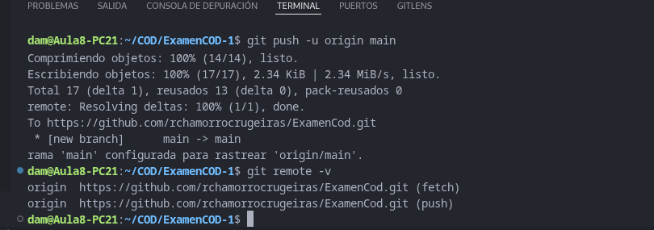
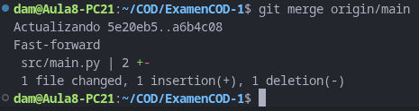
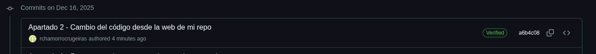

# Examen 1ª Evaluación (2ª Parte) - Control de Versiones

René Chamorro Crugeiras 1ºDAM
---

## Instrucciones
- Los commits de cada apartado deben tener el mensaje *"Apartado X - descripción del cambio realizado"*
- Entrega en la tarea de Moodle tu repositorio
- Solo se corrigen los commits que estén en el repositorio remoto

### Apartado 1

- Clona este repositorio.
- Modifica este Readme, poniendo tu nombre completo, realiza un `commit` con el mensaje *"Apartado 1"* y un `push`.

Pregunta 
- ¿Qué paso es fundamental cuando clonamos un repositorio ajeno para que podamos subir nuestros propios commits? Explícalo y utiliza capturas de pantalla.

*Respuesta*
El paso fundamental es tener permisos de escritura sobre el repositorio remoto, lo que normalmente se consigue de dos formas:
- *Ser colaborador del repositorio original*, o
- *Hacer un fork del repositorio* en nuestra cuenta de GitHub y clonar ese fork.
Si clonamos directamente un repositorio ajeno *sin permisos*, podremos:
- Ver el código
- Modificarlo localmente
- Hacer commits
Pero *no podremos hacer* `push`, ya que GitHub rechazará la subida por falta de permisos.



### Apartado 2

- Realiza una modificación en el código en la web de tu repositorio en GitHub
- Utiliza fetch para descargar los cambios realizados en tu repositorio.

Pregunta
- Explica los pasos para que el código modificado en GitHub, llegue a tu rama principal local. Explícalo con capturas de pantalla.

*Respuesta*
Cuando realizas un cambio directamente en la web de tu repositorio en GitHub (por ejemplo, editando un archivo en línea), esos cambios no se reflejan automáticamente en tu copia local del repositorio. Para traerlos a tu máquina, debes usar fetch y luego integrar los cambios.
1. Hacer el cambio en GitHub
- Modifica un archivo desde la interfaz web de GitHub (por ejemplo, cambia un texto en README.md).
- Guarda el cambio haciendo clic en Commit changes.
2. Traer los cambios a tu repositorio local usando fetch
- Abre tu terminal o Git Bash en la carpeta de tu repositorio local.
- Ejecuta:
```git fetch origin```
- Esto descargará la información de los cambios realizados en GitHub, pero no los aplica todavía a tu rama local.
3. Integrar los cambios en tu rama principal
Después de hacer fetch, tienes que traer los cambios a tu rama actual (normalmente main o master) usando:
```git merge origin/main```
- Esto aplica los cambios descargados a tu rama local.
- Si tu rama principal se llama diferente, reemplaza main por el nombre correcto.





### Apartado 3

- Realiza otro cambio desde la web de tu repositorio en GitHub.
- Utiliza pull para descargar los cambios realizados en tu repositorio.

Pregunta
- Explica los pasos dados para que el cambio realizado en GitHub, llegue a tu rama principal local. Explícalo con capturas de pantalla.

